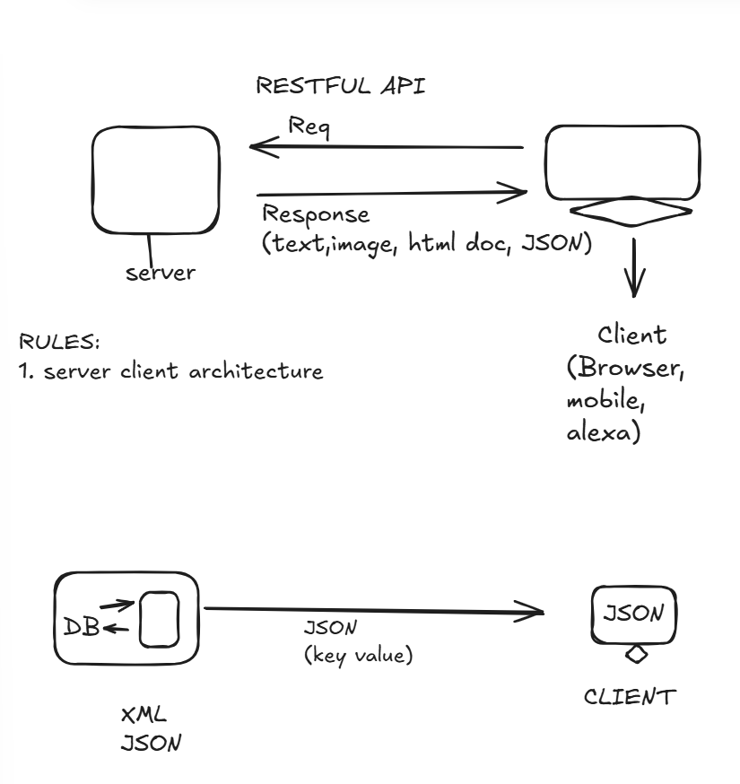

# nodejs-revision
nodejs-revision - notes &amp; codes

## Architecture of Node.js

-   Client makes a request to the server; requests get into the event queue.
-   Then these requests are picked up by the event loop.
-   **Blocking operations** = synchronous operations; **non-blocking operations** = asynchronous operations.
-   If non-blocking operations, then the response is sent to the user; if blocking operations, then the response is not sent to the user.
-   If blocking operations, then this operation goes to the thread pool.
-   The thread pool is a pool of threads that are used to perform blocking operations in Node.js.
-   A thread is assigned to every blocking operation; once the operation is completed, the response is sent to the user and the thread is released back to the thread pool.

**Sync** : Blocking request; the code will not execute until the file is written
`fs.writeFileSync("./test.txt", "Ram Ram");`

**Async** : Non-blocking request; the code will execute without waiting for the file to be written
`fs.writeFile("./test.txt", "Ram Ram", (err) => {})`

- blocking operation:
- read contact.txt file
- Code executes top to bottom
- by default thread size = 4 , size can be increased but max ?
- max - depends on the number of cpu cores

**non-blocking** :

`console.log("1");
fs.readFile("contact.txt", "utf-8", (err, result) => {
    console.log(result);
})
console.log("2");`

#RESTful API :

##Else things are in the respective ccode files. 